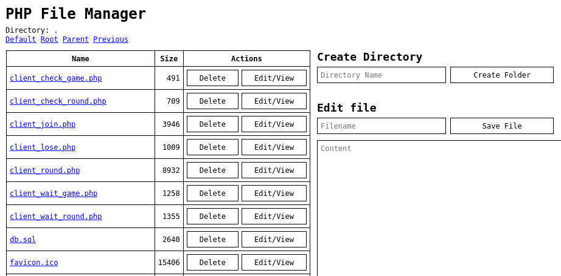

# php-filemanager

A very simple PHP File Manager. The code is a mess ... sorry.

Functions: Delete, View, Edit text files in the browser; Create and Delete (empty) Folders

To copy a file: Click View/Edit, then Save under another name

To move/rename a file: Copy, then Delete original

Usage: `localhost/update.php?p=password&d=.`

If the password is wrong, a 404 page is shown.
The password can be changed with `$pwd`

If you rename the file to something else than `update.php`, you need to change the `$url0` variable.

## Screenshot

